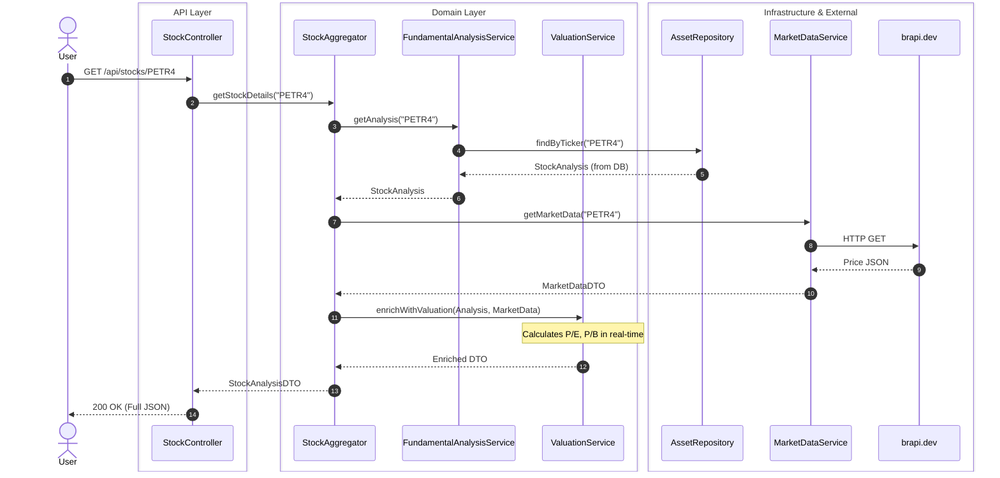
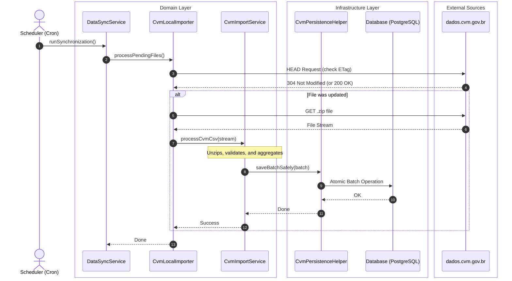

[🇧🇷 Portuguese Version](README.md)

  

  <strong>Financial Market Intelligence Platform for Stock and Cryptocurrency Analysis.</strong>

    
    
    
    
    

  <a href="#-screenshots">Screenshots</a> •
  <a href="#-about-the-project">About</a> •
  <a href="#-key-features">Features</a> •
  <a href="#-architecture">Architecture</a> •
  <a href="#-data-flows">Flows</a> •
  <a href="#-design-decisions-adr">ADRs</a> •
  <a href="#-api-documentation">API</a>

## 📸 Screenshots

<table>
  <tr>
    <td valign="top" width="50%">
       
      <b>Main Dashboard</b>
      
       
      <i>General overview of market indexes, quotes, and portfolio.</i>
    </td>
    <td valign="top" width="50%">
       
      <b>Asset Analysis (PETR4)</b>
      
       
      <i>Dynamic charts and fundamental indicators like P/E and ROE.</i>
    </td>
  </tr>
  <tr>
    <td valign="top" width="50%">
       
      <b>Annual Tabular View</b>
      
       
      <i>Compare annual financial statements in detail.</i>
    </td>
    <td valign="top" width="50%">
       
      <b>Unified Search Engine</b>
      
       
      <i>Quickly search for stocks, REITs, BDRs, and cryptocurrencies.</i>
    </td>
  </tr>
</table>

## 📌 About the Project

**AçõesJá** is a full-stack ecosystem designed to democratize access to high-quality financial data. The system ingests, processes, and analyzes gigabytes of accounting data directly from Brazil's SEC (**CVM**) and cross-references it with real-time quotes from the **B3** stock exchange and crypto markets. The goal is not just to display numbers, but to offer investment insights through an automated analysis engine, presented in a high-performance, interactive dashboard.

## ✨ Key Features

- **Complete Fundamental Analysis:** Automatically calculated Valuation (P/E, P/B), Profitability (ROE, ROIC), and Debt ratios.
- **Robust ETL Data Pipeline:** A resilient `Importer` module that processes, validates, and stores gigabytes of CVM data, featuring a quarantine system for corrupted records.
- **Real-Time Quotes:** Integration with market APIs to provide up-to-date prices for stocks and cryptocurrencies.
- **Secure Authentication:** Stateless authentication system via JWT (JSON Web Tokens).
- **Unified Search:** Find any asset from the Brazilian market or crypto space in seconds.
- **Clean Architecture:** Decoupled and testable backend with a clear separation between domain, application, and infrastructure layers.

## 🏗️ Architecture

The system was designed with a focus on separation of concerns, scalability, and long-term maintainability, using **Clean Architecture** and **Domain-Driven Design (DDD)** principles.

- **Client Layer:** A Single Page Application (SPA) consumes data via optimized REST calls.
- **API Layer:** Spring Boot provides secure endpoints (Stateless with JWT) and validates incoming requests.
- **Domain & Application Layer:** The pure business logic (fundamental analysis calculations, valuation) resides here, completely isolated from external frameworks.
- **Infrastructure & Data Layer:** This layer is responsible for data persistence in PostgreSQL and integrations with external services, such as market APIs (B3) and CVM file extraction.

## 🔀 Data Flows

### Flow 1: Stock Analysis Query
How the system processes a user request to view a comprehensive asset analysis, cross-referencing database information with real-time external APIs:

### Flow 2: Scheduled CVM Data Import (ETL Pipeline)
How the system ensures fundamental data is always up-to-date by fetching gigabytes of government files in an optimized and fault-tolerant manner:

## 🧠 Design Decisions (ADR)

- **1. `Company` vs. `Asset` Separation:** The domain model distinguishes the `Company` (legal entity with financials) from the `Asset` (tradable ticker with a price), allowing for the accurate cross-referencing of a single company's fundamental data against its multiple asset classes (e.g., common vs. preferred stock).
- **2. Self-Healing Financial Statements:** A *Self-Healing* algorithm attempts to infer and correct inconsistencies in CVM balance sheets (where Assets ≠ Liabilities + Equity) before discarding the data, drastically increasing the availability of useful information.
- **3. Quarantine for Corrupted Data:** Malformed CSV rows are isolated in a quarantine table, ensuring that a single bad record does not stop the entire pipeline from processing gigabytes of valid data.

## 📖 API Documentation

The complete and interactive API documentation, including all endpoints, DTOs, and authentication schemes, is available via Javadoc and can be viewed on the GitHub Pages deployment of this repository.

🔗 **[Access Full Documentation](https://raphaelfeijosalles.github.io/acoes-ja-showcase/)**

---

  Developed with ☕ and clean code by <a href="https://github.com/RaphaelFeijoSalles" target="_blank">Raphael Salles</a>.

