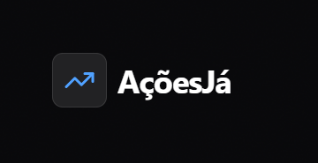
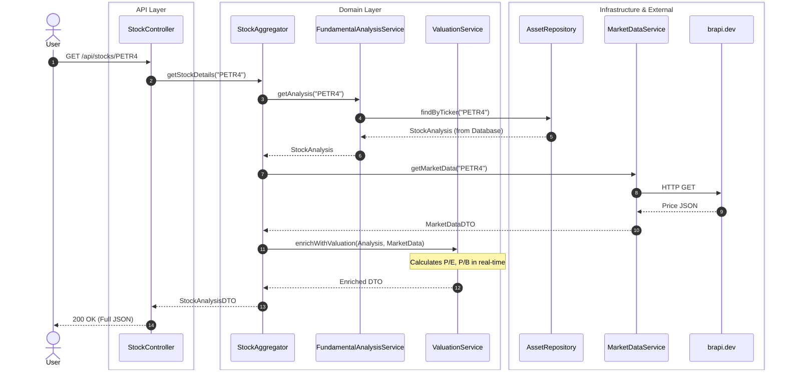
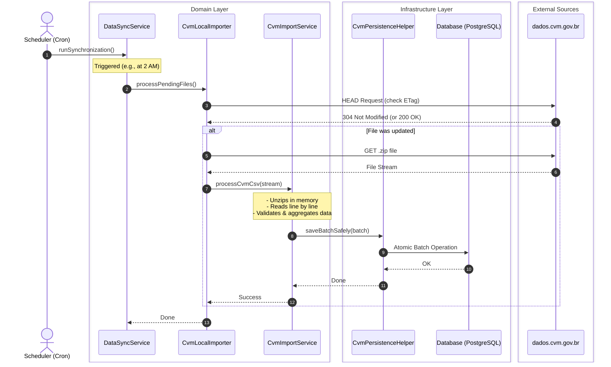
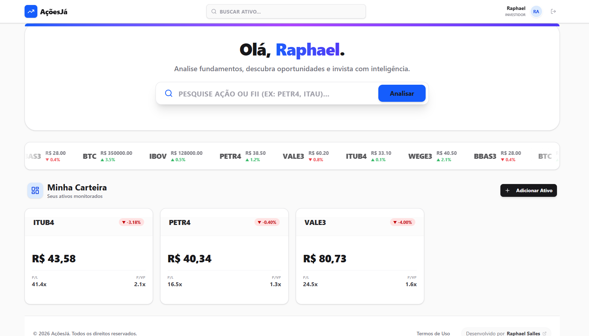
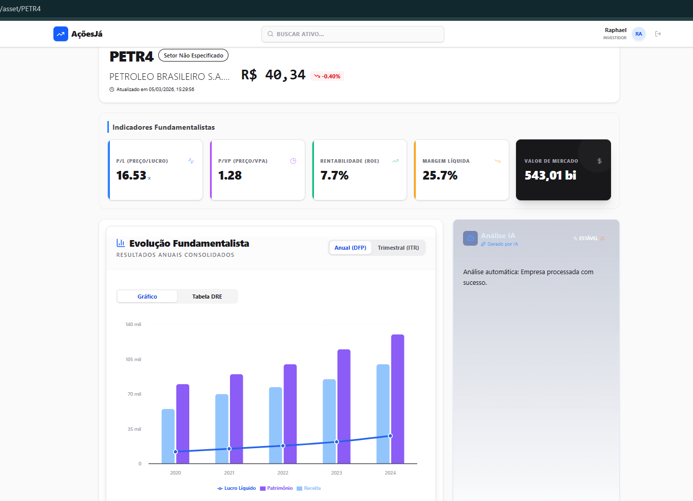
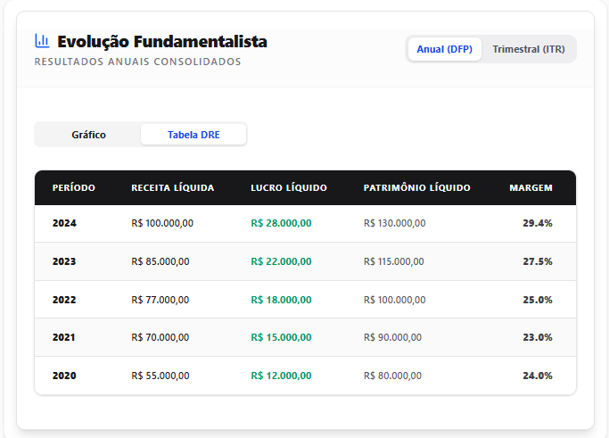
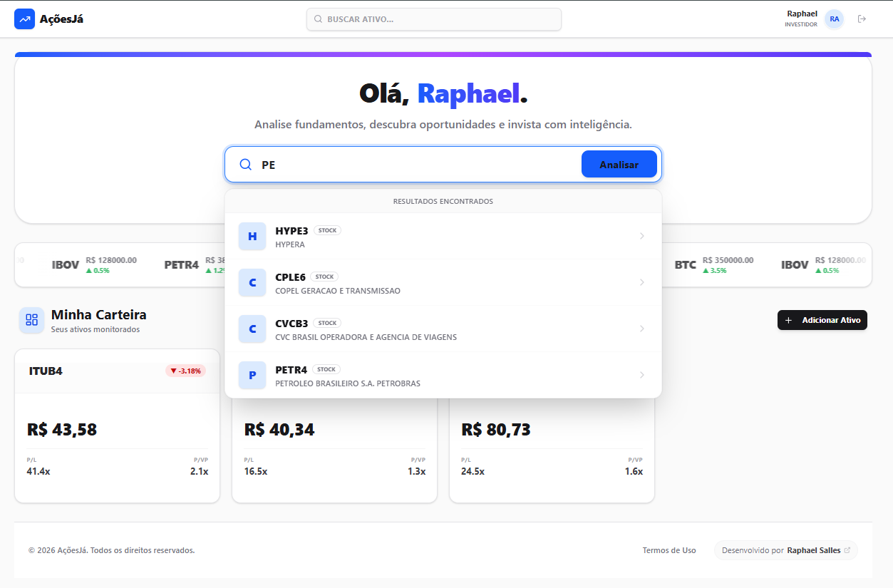

[pt-BR Versão em Português](README.md)

  

  <strong>Financial Intelligence Platform with Automated Fundamental Analysis via AI.</strong>

  <a href="#-about-the-project">About</a> •
  <a href="#-architecture">Architecture</a> •
  <a href="#-data-pipeline">Data Pipeline</a> •
  <a href="#%EF%B8%8F-technologies">Technologies</a> •
  <a href="#-design-decisions">Design Decisions</a> •
  <a href="#-screenshots">Screenshots</a>

---

## 📌 About the Project

**AçõesJá** is a full-stack ecosystem designed to democratize access to high-quality financial data. The system ingests, processes, and analyzes gigabytes of accounting data directly from the **CVM** (Securities and Exchange Commission of Brazil) and cross-references it with real-time quotes from the **B3** (Brazilian Stock Exchange).

The goal isn't just to display numbers, but to offer instant investment insights through a rules engine and automated analysis, presented in a high-performance interactive dashboard.

## 🏗️ Architecture

The system was designed with a focus on separation of concerns, scalability, and long-term maintainability, using **Clean Architecture** and **Domain-Driven Design (DDD)** principles on the backend, and a modular component-based approach on the frontend.

## 📐 Architecture Flows (Sequence Diagrams)

To ensure separation of concerns, the system orchestrates requests through well-defined layers: **API**, **Domain** (where the business logic resides), and **Infrastructure**.

### Flow 1: Stock Analysis Query
How the system processes a user request to view a comprehensive asset analysis (e.g., PETR4), cross-referencing database information with real-time external APIs:

### Flow 2: Scheduled CVM Data Import (ETL Pipeline)
How the system ensures fundamental data is always up-to-date by fetching gigabytes of government files in an optimized and fault-tolerant manner:

### Core Flow:
1. **Client Layer:** React SPA consuming data via optimized REST calls.
2. **API Layer:** Spring Boot providing secure endpoints (Stateless JWT) and validating requests.
3. **Domain & Application:** Pure business logic (fundamental analysis, valuation) completely isolated from external frameworks.
4. **Data & External:** Persistence in PostgreSQL and integrations with market APIs (B3) and CVM file extraction.

## ⚙️ Data Pipeline

One of the major technical challenges of the project was ensuring the consistency of massive, irregularly formatted government data.

Our `Importer` module works as a robust **ETL (Extract, Transform, Load)** pipeline:
* **Ingestion:** Batch Processing of heavy CVM files.
* **Classification:** Utilization of the *Strategy Pattern* (`AccountClassifier`) to dynamically categorize accounting items.
* **Traceability:** Full audit trail from the raw CSV line to the consolidated calculated indicator (e.g., P/E, ROE).

## 🛠️ Technologies

The stack was chosen to ensure maximum typing, performance, and end-to-end security.

### 🖥️ Frontend (React SPA)
Built to be a fast, responsive, and interactive dashboard.
* **Core:** React with TypeScript + Vite (Ultra-fast build).
* **State Management:** Zustand (Lightweight global state) + React Query (Data fetching, caching, and synchronization).
* **Styling & UI:** Tailwind CSS for utility-first styling and shadcn/ui for accessible components.
* **Data Visualization:** Recharts for rendering interactive financial charts.
* **Routing:** React Router DOM for fluid SPA navigation.

### 🖧 Backend (RESTful API)
Built for heavy processing and institutional-grade stability.
* **Core:** Java 25 (LTS) + Spring Boot 3.
* **Database:** PostgreSQL (Production) / H2 (Development/Testing).
* **Security:** Spring Security + JWT (Stateless Authentication).
* **Design Patterns:** Clean Architecture, DDD, Strategy, Factory.

## 📖 API Documentation

The API was designed to be consumed intuitively. All endpoint documentation, request/response contracts (DTOs), and authentication schemes are interactively available.

🔗 **[Access Full Swagger UI](#)** *(Temporary link for demonstration: `https://raphaelfeijosalles.github.io/acoes-ja-showcase/`)*.

## 🧠 Design Decisions

Engineering decisions made to solve real-world complex domain problems:

### 1. Company vs. Asset Model
In the financial market, a company is not the same as its trading ticker.
* **Decision:** Strict separation in the domain between the `Company` Entity (e.g., Petrobras, which holds the balance sheet and corporate ID) and the `Asset` Entity (e.g., PETR3, PETR4, which have different quotes, liquidity, and voting rights).
* **Impact:** Allows accurate cross-referencing of fundamental indicators from a single company against multiple asset classes.

### 2. Self-Healing Financial Statements
Public data often contains input errors or non-standard consolidated accounts.
* **Decision:** Implementation of a *Self-Healing* algorithm. If the CVM balance sheet doesn't balance (Assets ≠ Liabilities + Equity), the engine attempts to infer the missing account based on universal accounting rules before rejecting the batch.
* **Impact:** Drastic increase in the availability of useful data without manual intervention.

### 3. Quarantine for Corrupted CVM Data
When processing gigabytes of data, a malformed line cannot crash the pipeline.
* **Decision:** Implementation of a quarantine system. CSV lines that fail structural or logical validation are diverted to a *Quarantine* table, allowing the pipeline to finish processing the rest of the file.
* **Impact:** High fault tolerance. Quarantined data can be analyzed and reprocessed later.

## 📸 Screenshots

<table>
  <tr>
    <td valign="top" width="50%">
       
      <b>Main Dashboard</b>
      
       
      <i>Overview of indices, quotes, and user portfolio.</i>
    </td>
    <td valign="top" width="50%">
       
      <b>Asset Analysis (PETR4)</b>
      
       
      <i>Dynamic charts (Recharts) and P/E, ROE indicators.</i>
    </td>
  </tr>
  <tr>
    <td valign="top" width="50%">
       
      <b>Annual Tabular View</b>
      
       
      <i>Tabular data visualization for detailed analysis.</i>
    </td>
    <td valign="top" width="50%">
       
      <b>Unified Search Engine</b>
      
       
      <i>Quick search for assets, companies, and sectors.</i>
    </td>
  </tr>
</table>

---

  Developed with ☕ and clean code by <a href="https://github.com/RaphaelFeijoSalles" target="_blank">Raphael Salles</a>.

