[🇧🇷 Leia em português](README.md)

  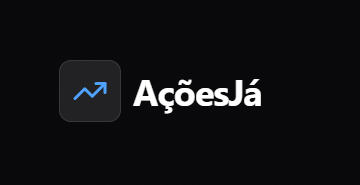

<h1 align="center">Brazilian financial data, organized for analysis</h1>

  Search assets, explore fundamentals and financial history, and maintain a personal watchlist in a full-stack experience.

  
  
  
  
  

  <a href="#experience">Experience</a> ·
  <a href="#verified-features">Features</a> ·
  <a href="#how-it-works">How it works</a> ·
  <a href="#for-recruiters">For recruiters</a> ·
  <a href="https://acoesja.com.br">Live demo</a> ·
  <a href="https://linktr.ee/raphaelfeijosalles">Contact</a>

> Educational financial analysis platform. Its content does not constitute investment advice.

> Public beta/portfolio demo with no billing or SLA. The AI Professor's external
> provider, commercial quotas, and canary remain disabled; the interface reports
> this unavailability explicitly.

## The idea

Accounting statements and market data are usually scattered across multiple sources and formats. AçõesJá turns them into a single journey:

1. search a company by ticker, name, or Brazilian company ID;
2. inspect indicators and annual or quarterly statements;
3. follow price history alongside accounting data;
4. save tickers to a personal watchlist;
5. export authorized analyses to `.xlsx`.

The project also automates the ingestion of CVM annual/quarterly statements, company registration data, and FRE share data, while keeping history, controls, and import auditing.

## Experience

<table>
  <tr>
    <td valign="top" width="50%">
      <strong>Dashboard and watchlist</strong> 
      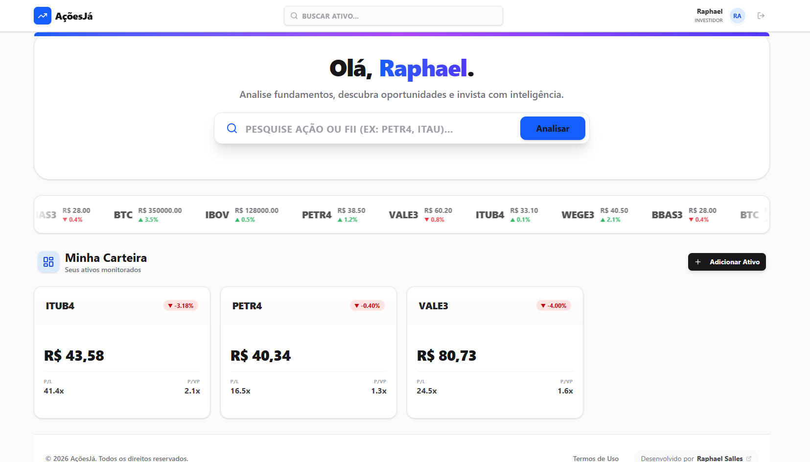
      <small>Entry point for search, market information, and saved tickers.</small>
    </td>
    <td valign="top" width="50%">
      <strong>Asset analysis</strong> 
      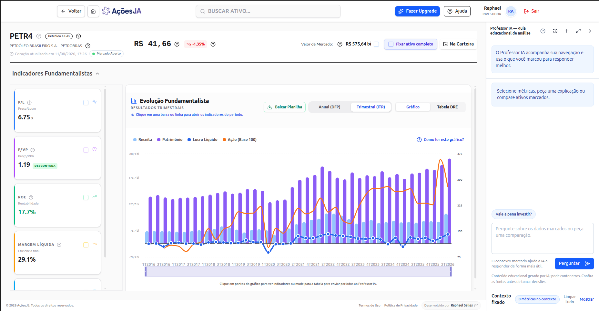
      <small>Fundamentals, market data, and annual or quarterly history.</small>
    </td>
  </tr>
  <tr>
    <td valign="top" width="50%">
      <strong>Financial history</strong> 
      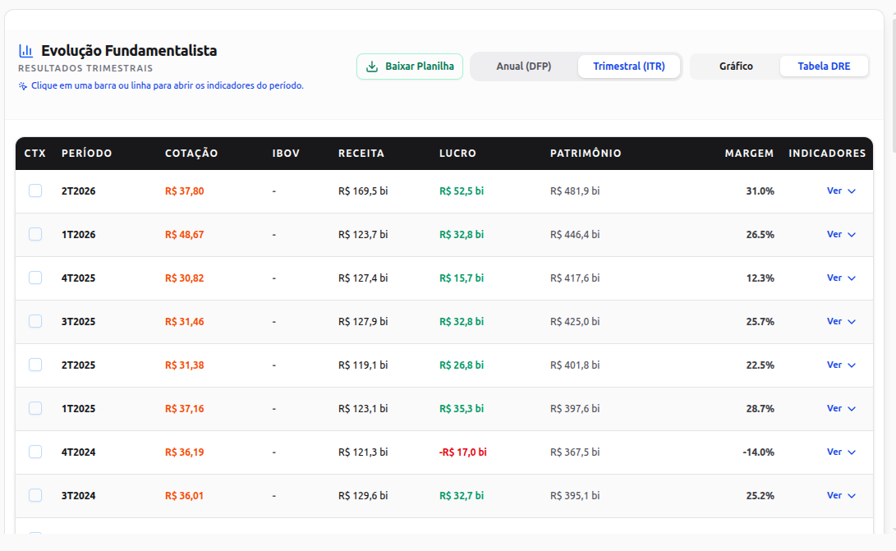
      <small>Structured reading of periods and financial indicators.</small>
    </td>
    <td valign="top" width="50%">
      <strong>Unified search</strong> 
      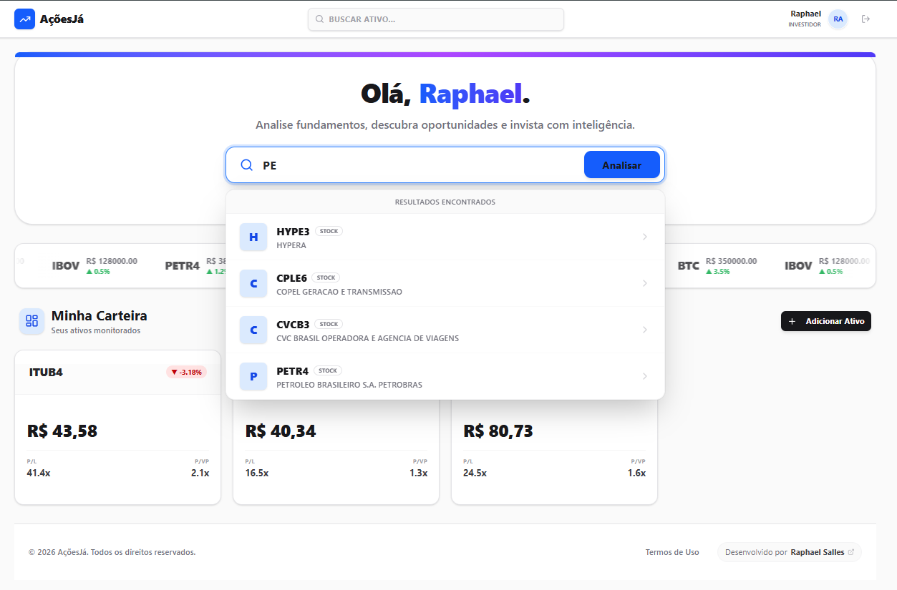
      <small>Public asset discovery by ticker, name, or company ID.</small>
    </td>
  </tr>
</table>

### Public access

  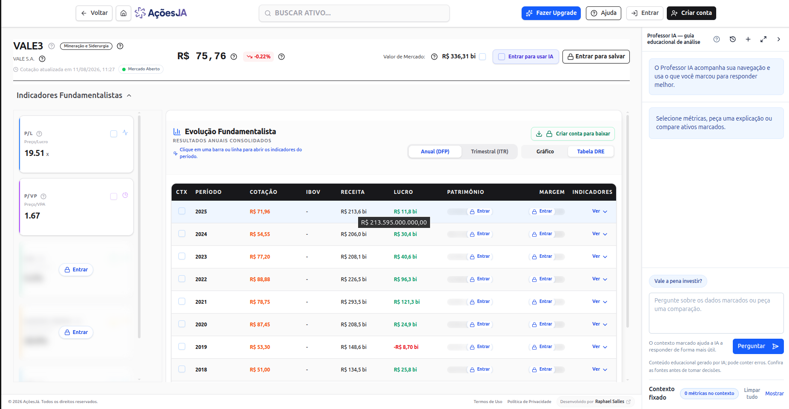
  <small>Fundamentals and history are available without login, while authenticated features are clearly identified.</small>

### Authentication and consent

<table>
  <tr>
    <td valign="top" width="50%">
      <strong>Password or Google sign-in</strong> 
      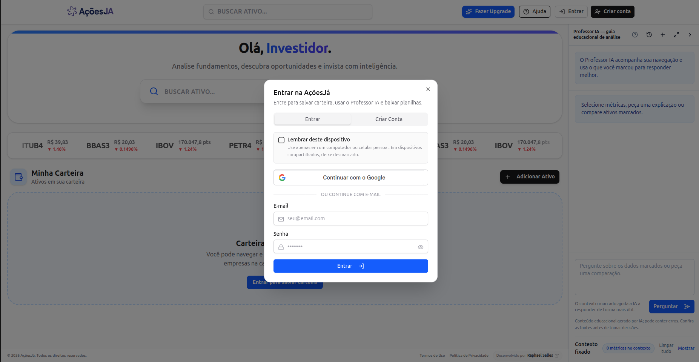
      <small>Access to the watchlist and exports; the AI Professor requires a controlled provider activation.</small>
    </td>
    <td valign="top" width="50%">
      <strong>Google integration</strong> 
      
      <small>Social sign-in connected to the public domain.</small>
    </td>
  </tr>
  <tr>
    <td valign="top" width="50%">
      <strong>Versioned Terms of Use</strong> 
      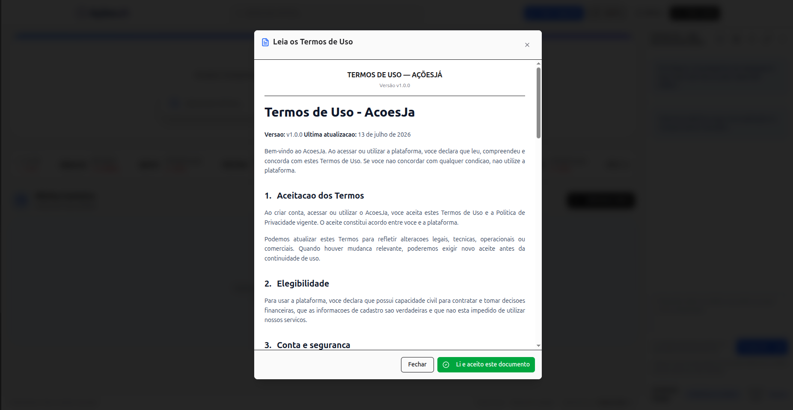
    </td>
    <td valign="top" width="50%">
      <strong>Privacy Policy</strong> 
      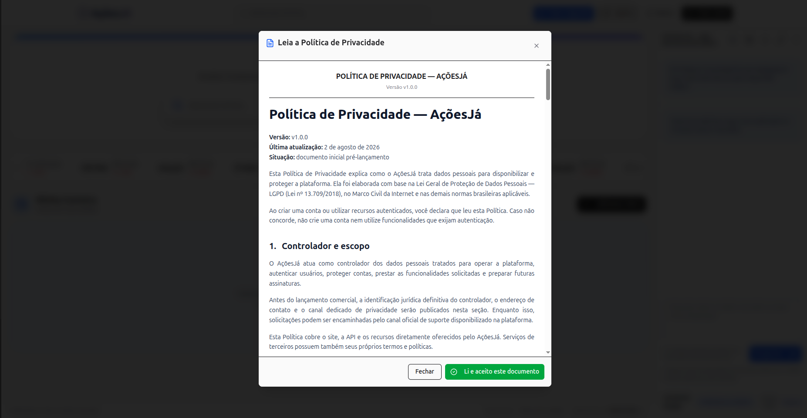
    </td>
  </tr>
</table>

### AI Professor — prepared experience

  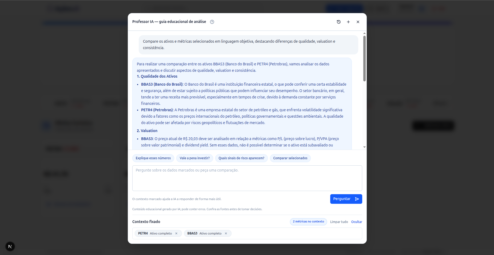
  <small>Flow captured in a controlled environment. In the current public demo, the provider is disabled and no mock is presented as a real LLM response.</small>

### Administration

<table>
  <tr>
    <td valign="top" width="50%">
      <strong>Guided data bootstrap</strong> 
      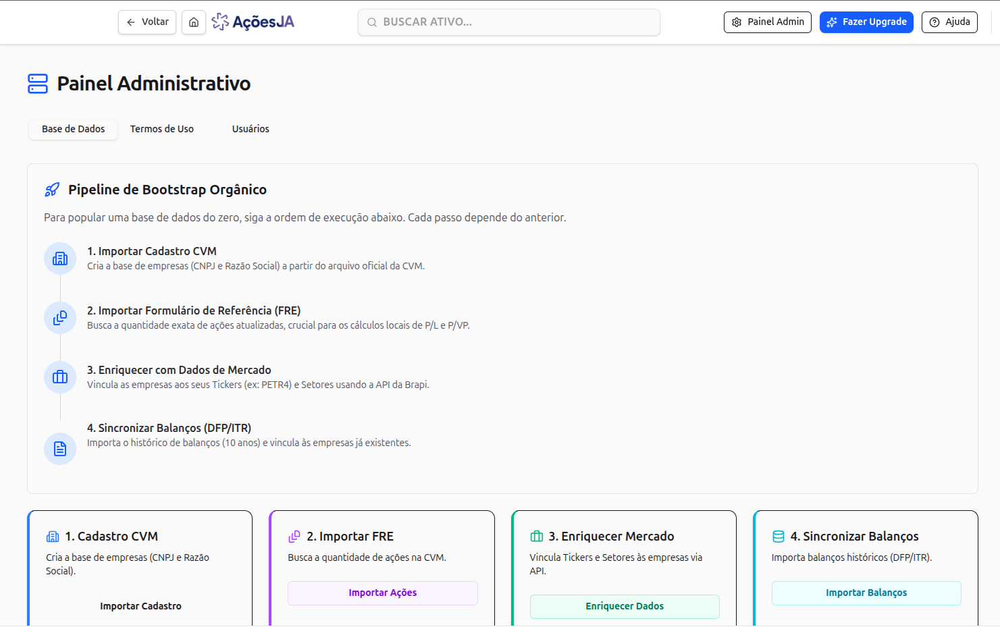
    </td>
    <td valign="top" width="50%">
      <strong>Legal document publishing</strong> 
      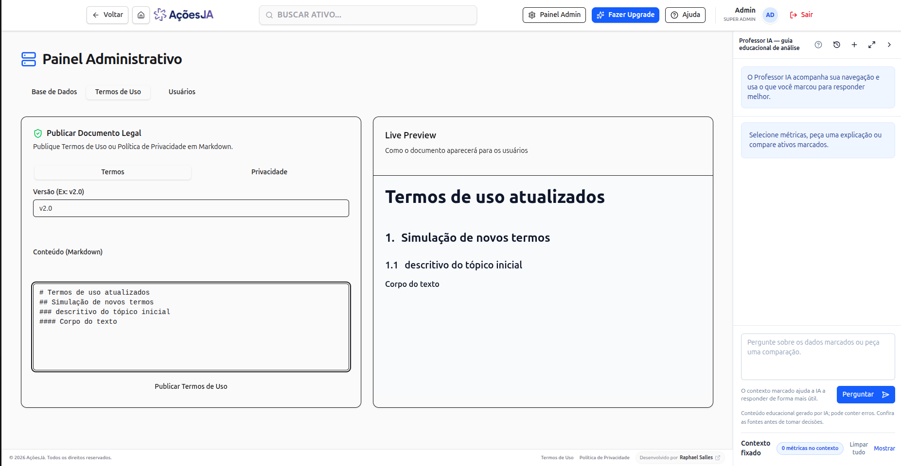
    </td>
  </tr>
  <tr>
    <td valign="top" colspan="2">
      <strong>User and role management</strong> 
      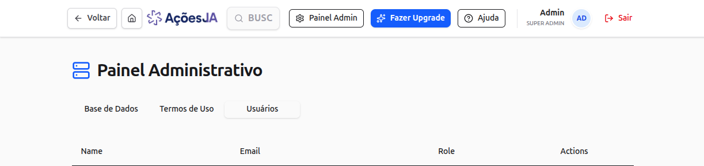
    </td>
  </tr>
</table>

## Verified features

### For asset analysis

- Public search and asset details.
- Fundamental indicators and DFP/ITR financial history.
- Persisted historical quotes associated with financial periods when available; coverage is still incremental.
- Authenticated personal ticker watchlist.
- XLSX export for authorized profiles.
- AI Professor interface, context, and guardrails; the real provider remains disabled in the public demo.

### Identity and UX

- Password registration and login.
- Google social login.
- JWTs in HttpOnly cookies and silent renewal.
- Role-based access and protected administration routes.
- Versioned Terms of Use and Privacy Policy.
- Loading, error, empty, unavailable, and access-restricted states.

### Data operations

- CVM DFP/ITR, company registration, and FRE ingestion.
- Separation of consolidated and individual statements.
- Historical quote persistence.
- Brapi market integration with AlphaVantage as a historical fallback.
- Import history, errors, auditing, and reprocessing.
- Spreadsheet generation with Apache POI.

## How it works

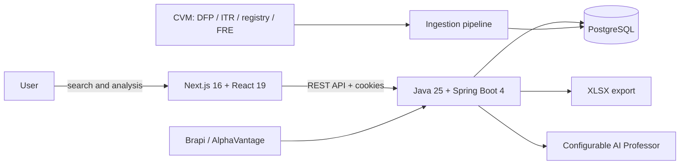
```mermaid
flowchart LR
    Person[User] -->|search and analysis| Web[Next.js 16 + React 19]
    Web -->|REST API + cookies| API[Java 25 + Spring Boot 4]
    API --> DB[(PostgreSQL)]
    CVM[CVM: DFP / ITR / registry / FRE] --> PIPE[Ingestion pipeline]
    PIPE --> DB
    MARKET[Brapi / AlphaVantage] --> API
    API --> XLSX[XLSX export]
    API --> AI[Configurable AI Professor]
```

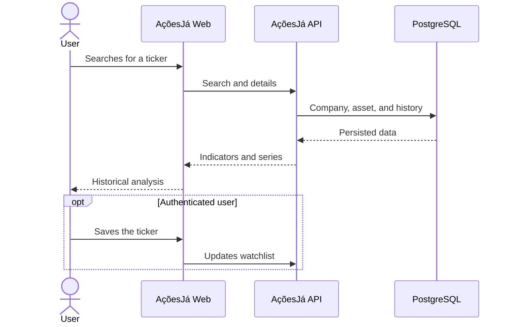
```mermaid
sequenceDiagram
    actor Person as User
    participant Web as AçõesJá Web
    participant API as AçõesJá API
    participant DB as PostgreSQL

    Person->>Web: Searches for a ticker
    Web->>API: Search and details
    API->>DB: Company, asset, and history
    DB-->>API: Persisted data
    API-->>Web: Indicators and series
    Web-->>Person: Historical analysis
    opt Authenticated user
        Person->>Web: Saves the ticker
        Web->>API: Updates watchlist
    end
```

## Technology stack

| Backend | Frontend | Data and delivery |
|---|---|---|
| Java 25 | Next.js 16 | PostgreSQL |
| Spring Boot 4.0.5 | React 19 | Flyway |
| Spring Security | TypeScript 5.9 | Docker |
| Spring Data JPA | TanStack Query | GitHub Actions |
| Spring AI/Caffeine | Axios/Zustand | Fly.io configuration |
| Apache POI | Recharts/Tailwind | Dependabot |

## High-level technical decisions

### A company is not a ticker

`Company` represents the issuer, while `Asset` represents a traded instrument. Multiple share classes can therefore share the issuer's financial statements.

### Migrations own schema evolution

Flyway records database changes, while Hibernate validates the structure during normal execution.

### Tokens stay outside JavaScript

JWTs travel in HttpOnly cookies; the frontend coordinates session renewal without directly reading the tokens.

### Consolidated and individual scopes stay separate

The ingestion pipeline identifies the accounting scope and prioritizes consolidated statements to preserve analytical consistency.

## For recruiters

This project demonstrates full-stack work in a domain that requires business rules, numeric precision, and integrations:

- REST APIs and financial processing with Java 25 and Spring Boot 4.
- Data-oriented UI with Next.js 16, React 19, and TypeScript.
- Relational modeling with JPA, PostgreSQL, and Flyway migrations.
- Password/Google authentication, JWTs in HttpOnly cookies, and role-based access.
- Auditable public CVM data pipelines and market data integrations.
- Automated tests and continuous integration across the backend and frontend repositories.

## Let's talk

If you would like to discuss the product, its technical decisions, or a Full-Stack Java + React/Next.js opportunity:

  <a href="https://linktr.ee/raphaelfeijosalles"><strong>Contact and professional profile</strong></a>

---

  Built by Raphael Salles · Proprietary project, not distributed under an open-source license.

