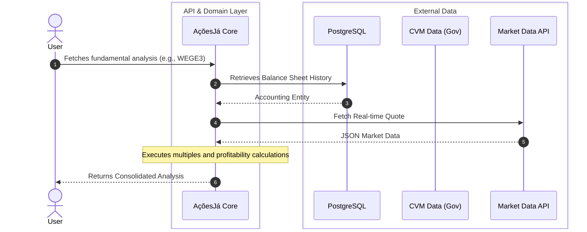

[🇧🇷 Versão em Português](README.md)

  

  <strong>Financial Market Intelligence and Data Crossing Platform.</strong>

    
    
    
    

  <a href="#-screenshots">Screenshots</a> •
  <a href="#-about-the-project">About</a> •
  <a href="#-key-features">Features</a> •
  <a href="#-architecture">Architecture</a> •
  <a href="#-data-flow">Data Flow</a>

## 📸 Screenshots

<table>
  <tr>
    <td valign="top" width="50%">
       
      <b>Main Dashboard</b>
      
       
      <i>Overview of indices, market quotes, and portfolio.</i>
    </td>
    <td valign="top" width="50%">
       
      <b>Asset Analysis (PETR4)</b>
      
       
      <i>Dynamic charts and fundamental indicators.</i>
    </td>
  </tr>
  <tr>
    <td valign="top" width="50%">
       
      <b>Tabular Data View</b>
      
       
      <i>Detailed comparison of annual financial statements.</i>
    </td>
    <td valign="top" width="50%">
       
      <b>Unified Search Engine</b>
      
       
      <i>Quick search for stocks, REITs (FIIs), BDRs, and cryptocurrencies.</i>
    </td>
  </tr>
</table>

## 📌 About the Project

**AçõesJá** is a full-stack ecosystem designed to cross-reference Brazilian financial market data with high performance. The system ingests and processes gigabytes of government accounting data directly from the **CVM** (Securities and Exchange Commission of Brazil) and structures it alongside real-time quotes and indicators from the **B3** Stock Exchange.

The platform operates natively on a Freemium model, offering everything from quick views of the latest fiscal quarter to exporting dense financial spreadsheets (featuring a decade of historical data) for premium subscribers.

## ✨ Key Features

- **CVM + B3 Crossing Engine:** Ingestion of official balance sheets crossed with real-time market prices for instant Valuation multiples calculation.
- **Optimized ETL Pipeline:** Structured data synchronizer designed to handle massive daily updates from government databases reliably.
- **Cache & High Performance:** Employment of in-memory caching strategies to store heavy financial reports, drastically reducing database I/O.
- **Integration Resilience:** Retry mechanisms and fault tolerance ensure system stability against oscillations or Rate Limits from external APIs (Brapi).
- **Stateless Authentication:** Robust protection using the Auth0 platform with short-lived JWTs and rotating Refresh Tokens.
- **Structured Export:** Dynamic `.xlsx` file generation engine formatted via *Apache POI* for offline financial modeling.

## 🏗️ Architecture

The ecosystem adopts **Clean Architecture** and **Domain-Driven Design (DDD)** principles to ensure the isolation of pricing logic and fundamental analysis.

- **Client Layer (React):** A reactive Single Page Application (SPA) that consumes the RESTful API optimally.
- **API Layer (Spring Boot):** Security and routing layer that completely isolates the domain from the web framework.
- **Domain & Infrastructure Layer:** Centralizes financial business rules, relational persistence in PostgreSQL, and synchronous/asynchronous integrations.

## 🔀 Data Flow (Core)

```mermaid
sequenceDiagram
    autonumber
    actor User
    box API & Domain Layer
        participant App as AçõesJá Core
    end
    box External Data
        participant DB as PostgreSQL
        participant CVM as CVM Data (Gov)
        participant B3 as Market Data API
    end

    User->>App: Fetches fundamental analysis (e.g., WEGE3)
    App->>DB: Retrieves Balance Sheet History
    DB-->>App: Accounting Entity
    App->>B3: Fetch Real-time Quote
    B3-->>App: JSON Market Data
    Note over App: Executes multiples and profitability calculations
    App-->>User: Returns Consolidated Analysis

```
---

  Developed with ☕ and clean code by <a href="https://linktr.ee/raphaelfeijosalles" target="_blank">Raphael Salles</a>.

  <small>Copyright © 2026 Raphael Salles. All rights reserved. The code in this repository is proprietary and does not have an open-source license. Unauthorized use, copying, distribution, or modification is strictly prohibited.</small>

