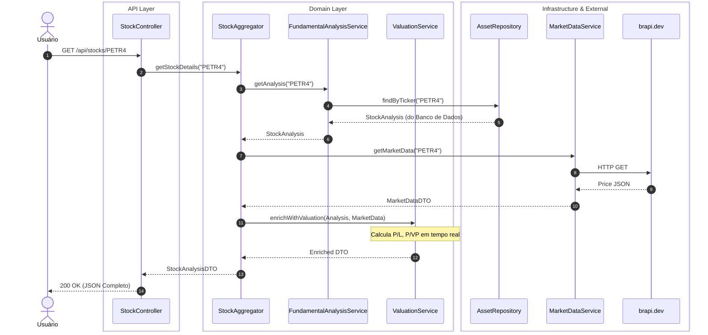
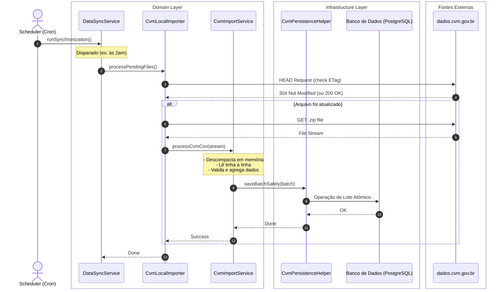

[🇺🇸 English Version](README-en.md)

  

  <strong>Plataforma de Inteligência Financeira com Análise Fundamentalista Automatizada via IA.</strong>

  <a href="#-sobre-o-projeto">Sobre</a> •
  <a href="#-architecture">Arquitetura</a> •
  <a href="#-data-pipeline">Data Pipeline</a> •
  <a href="#%EF%B8%8F-tecnologias">Tecnologias</a> •
  <a href="#-design-decisions">Design Decisions</a> •
  <a href="#-screenshots">Screenshots</a>

---

## 📌 Sobre o Projeto

O **AçõesJá** é um ecossistema full-stack projetado para democratizar o acesso a dados financeiros de alta qualidade. O sistema ingere, processa e analisa gigabytes de dados contábeis diretamente da **CVM** (Comissão de Valores Mobiliários) e os cruza com cotações em tempo real da **B3**.

O objetivo não é apenas exibir números, mas oferecer insights de investimento instantâneos através de um motor de regras e análise automatizada, apresentados em um dashboard interativo e de alta performance.

## 🏗️ Architecture

O sistema foi desenhado com foco em separação de responsabilidades, escalabilidade e manutenção a longo prazo, utilizando princípios de **Clean Architecture** e **Domain-Driven Design (DDD)** no backend, e uma abordagem baseada em componentes modulares no frontend.

### Fluxo Principal:
1. **Client Layer:** SPA em React consumindo dados via chamadas REST otimizadas.
2. **API Layer:** Spring Boot provendo endpoints seguros (Stateless JWT) e validando requisições.
3. **Domain & Application:** Lógica de negócio pura (análise fundamentalista, valuation) isolada de frameworks externos.
4. **Data & External:** Persistência no PostgreSQL e integrações com APIs de mercado (B3) e extração de arquivos da CVM.

## ⚙️ Data Pipeline

Um dos maiores desafios técnicos do projeto foi garantir a consistência de dados governamentais massivos e formatados de maneira irregular.

Nosso módulo `Importer` funciona como uma esteira **ETL (Extract, Transform, Load)** robusta:
* **Ingestão:** Processamento em lote (Batch Processing) de arquivos pesados da CVM.
* **Classificação:** Utilização do *Strategy Pattern* (`AccountClassifier`) para categorizar contas contábeis dinamicamente.
* **Rastreabilidade:** Auditoria completa desde a linha do CSV bruto até a consolidação do indicador calculado (P/L, ROE).

## 📐 Arquitetura de Fluxos (Sequence Diagrams)

Para garantir a separação de responsabilidades (Clean Architecture), o sistema orquestra as requisições passando por camadas bem definidas: **API**, **Domain** (onde reside a regra de negócio) e **Infrastructure**.

### Fluxo 1: Consulta de Análise de Ação
Como o sistema processa a requisição de um usuário para visualizar a análise completa de um ativo (ex: PETR4), cruzando dados do banco com APIs externas em tempo real:

### Fluxo 2: Importação Agendada de Dados CVM (Pipeline ETL)
Como o sistema garante que os dados fundamentalistas estejam sempre atualizados, buscando gigabytes de arquivos governamentais de forma otimizada e tolerante a falhas:

## 🛠️ Tecnologias

A stack foi escolhida para garantir máxima tipagem, performance e segurança de ponta a ponta.

### 🖥️ Frontend (React SPA)
Construído para ser um dashboard interativo, rápido e responsivo.
* **Core:** React com TypeScript + Vite (Build ultra-rápido).
* **State Management:** Zustand (Estado global leve) + React Query (Data fetching, caching e sincronização).
* **Styling & UI:** Tailwind CSS para estilização utility-first e shadcn/ui para componentes acessíveis.
* **Data Visualization:** Recharts para renderização de gráficos financeiros interativos.
* **Routing:** React Router DOM para navegação SPA fluida.

### 🖧 Backend (API RESTful)
Construído para processamento pesado e estabilidade institucional.
* **Core:** Java 25 (LTS) + Spring Boot 3.
* **Database:** PostgreSQL (Produção) / H2 (Desenvolvimento/Testes).
* **Security:** Spring Security + JWT (Autenticação Stateless).
* **Design Patterns:** Clean Architecture, DDD, Strategy, Factory.

## 📖 API Documentation

A API foi projetada para ser consumida de forma intuitiva. Toda a documentação dos endpoints, contratos de requisição/resposta (DTOs) e esquemas de autenticação estão disponíveis de forma interativa(javadoc).

🔗 **[Acessar Swagger UI Completo](https://raphaelfeijosalles.github.io/acoes-ja-showcase/)**

## 🧠 Design Decisions

Decisões de engenharia tomadas para resolver problemas reais de domínio complexo:

### 1. Company vs. Asset Model
No mercado financeiro, uma empresa não é a mesma coisa que seu ticker de negociação.
* **Decisão:** Separação estrita no domínio entre a Entidade `Company` (ex: Petrobras, que detém o balanço patrimonial e CNPJ) e a Entidade `Asset` (ex: PETR3, PETR4, que possuem cotações, liquidez e direitos de voto diferentes).
* **Impacto:** Permite cruzar indicadores fundamentalistas de uma única empresa com múltiplas classes de ativos de forma precisa.

### 2. Self-Healing Financial Statements
Dados públicos frequentemente contêm falhas de preenchimento ou contas consolidadas de forma não-padrão.
* **Decisão:** Implementação de um algoritmo de auto-correção (*Self-Healing*). Se o balanço da CVM não fecha (Ativo ≠ Passivo + Patrimônio Líquido), o motor tenta inferir a conta faltante baseada em regras contábeis universais antes de rejeitar o lote.
* **Impacto:** Aumento drástico na disponibilidade de dados úteis sem intervenção manual.

### 3. Quarantine for Corrupted CVM Data
Ao processar gigabytes de dados, uma linha mal formatada não pode derrubar a esteira.
* **Decisão:** Implementação de um sistema de quarentena. Linhas do CSV que falham na validação estrutural ou lógica são desviadas para uma tabela de *Quarentena*, permitindo que o pipeline termine o processamento do restante do arquivo.
* **Impacto:** Tolerância a falhas elevada. Os dados em quarentena podem ser analisados e reprocessados posteriormente.

## 📸 Screenshots

<table>
  <tr>
    <td valign="top" width="50%">
       
      <b>Dashboard Principal</b>
      
       
      <i>Visualização geral de índices, cotações e portfólio.</i>
    </td>
    <td valign="top" width="50%">
       
      <b>Análise de Ativo (PETR4)</b>
      
       
      <i>Gráficos dinâmicos (Recharts) e indicadores P/L, ROE.</i>
    </td>
  </tr>
  <tr>
    <td valign="top" width="50%">
       
      <b>Visualização anual tabular </b>
      
       
      <i>Visualização tabular de dados</i>
    </td>
    <td valign="top" width="50%">
       
      <b>Motor de Busca Unificada</b>
      
       
      <i>Pesquisa rápida de ativos, empresas e setores.</i>
    </td>
  </tr>
</table>

---

  Desenvolvido com ☕ e código limpo por <a href="https://github.com/RaphaelFeijoSalles" target="_blank">Raphael Salles</a>.

