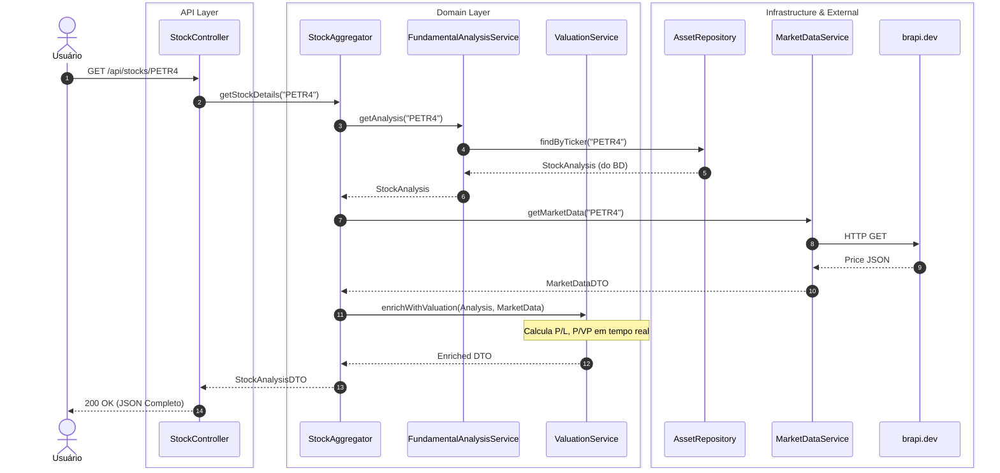
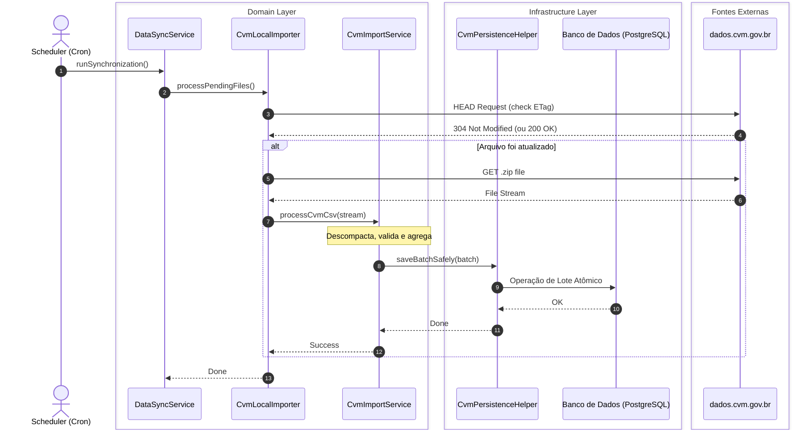

[🇺🇸 English Version](README-en.md)

  

  <strong>Plataforma de Inteligência de Mercado Financeiro para Análise de Ações e Criptomoedas.</strong>

    
    
    
    
    

  <a href="#-screenshots">Screenshots</a> •
  <a href="#-sobre-o-projeto">Sobre</a> •
  <a href="#-principais-funcionalidades">Funcionalidades</a> •
  <a href="#-arquitetura">Arquitetura</a> •
  <a href="#-fluxos-de-dados">Fluxos</a> •
  <a href="#-decisões-de-design-adr">ADRs</a> •
  <a href="#-documentação-da-api">API</a>

## 📸 Screenshots

<table>
  <tr>
    <td valign="top" width="50%">
       
      <b>Dashboard Principal</b>
      
       
      <i>Visualização geral de índices, cotações e portfólio.</i>
    </td>
    <td valign="top" width="50%">
       
      <b>Análise de Ativo (PETR4)</b>
      
       
      <i>Gráficos dinâmicos e indicadores fundamentalistas como P/L e ROE.</i>
    </td>
  </tr>
  <tr>
    <td valign="top" width="50%">
       
      <b>Visualização Anual Tabular</b>
      
       
      <i>Compare detalhadamente as demonstrações financeiras anuais.</i>
    </td>
    <td valign="top" width="50%">
       
      <b>Motor de Busca Unificada</b>
      
       
      <i>Pesquisa rápida por ações, FIIs, BDRs e criptomoedas.</i>
    </td>
  </tr>
</table>

## 📌 Sobre o Projeto

O **AçõesJá** é um ecossistema full-stack projetado para democratizar o acesso a dados financeiros de alta qualidade. O sistema ingere, processa e analisa gigabytes de dados contábeis diretamente da **CVM** e os cruza com cotações em tempo real da **B3** e de mercados de criptoativos. O objetivo não é apenas exibir números, mas oferecer insights de investimento através de um motor de análise automatizada, apresentados em um dashboard interativo e de alta performance.

## ✨ Principais Funcionalidades

- **Análise Fundamentalista Completa:** Indicadores de Valuation (P/L, P/VP), Rentabilidade (ROE, ROIC) e Endividamento calculados automaticamente.
- **Pipeline de Dados ETL Robusto:** Módulo de ingestão (`Importer`) que processa, valida e armazena de forma resiliente gigabytes de dados da CVM, com sistema de quarentena para dados corrompidos.
- **Cotações em Tempo Real:** Integração com APIs de mercado para fornecer preços atualizados de ações e criptomoedas.
- **Autenticação Segura:** Sistema de autenticação stateless via JWT (JSON Web Tokens).
- **Busca Unificada:** Encontre qualquer ativo do mercado brasileiro ou cripto em segundos.
- **Arquitetura Limpa (Clean Architecture):** Backend desacoplado e testável, com clara separação entre domínio, aplicação e infraestrutura.

## 🏗️ Arquitetura

O sistema foi desenhado com foco em separação de responsabilidades, escalabilidade e manutenção a longo prazo, utilizando princípios de **Clean Architecture** e **Domain-Driven Design (DDD)**.

- **Client Layer:** Um SPA (Single Page Application) consome os dados via chamadas REST otimizadas.
- **API Layer:** O Spring Boot provê endpoints seguros (Stateless com JWT) e valida as requisições de entrada.
- **Domain & Application Layer:** A lógica de negócio pura (cálculos de análise fundamentalista, valuation) reside aqui, completamente isolada de frameworks externos.
- **Infrastructure & Data Layer:** Camada responsável pela persistência de dados no PostgreSQL e pelas integrações com serviços externos, como APIs de mercado (B3) e a extração de arquivos da CVM.

## 🔀 Fluxos de Dados

### Fluxo 1: Consulta de Análise de Ação
Como o sistema processa a requisição de um usuário para visualizar a análise completa de um ativo, cruzando dados do banco com APIs externas em tempo real:

### Fluxo 2: Importação Agendada de Dados CVM (Pipeline ETL)
Como o sistema garante que os dados fundamentalistas estejam sempre atualizados, buscando gigabytes de arquivos governamentais de forma otimizada e tolerante a falhas:

## 🧠 Decisões de Design (ADR)

- **1. Separação `Company` vs. `Asset`:** O modelo de domínio distingue a `Empresa` (CNPJ, balanços) do `Ativo` (ticker, cotação), permitindo cruzar dados fundamentalistas de uma empresa com suas múltiplas classes de ativos (ON, PN) de forma precisa.
- **2. Auto-Correção de Balanços:** Um algoritmo de *Self-Healing* tenta inferir e corrigir inconsistências nos balanços da CVM (Ativo ≠ Passivo + PL) antes de descartar os dados, aumentando drasticamente a disponibilidade de informações.
- **3. Quarentena de Dados Corrompidos:** Linhas de CSV mal formatadas são isoladas em uma tabela de quarentena, garantindo que a falha em um registro não interrompa o processamento de gigabytes de dados válidos.

## 📖 Documentação da API

A documentação completa e interativa da API, incluindo todos os endpoints, DTOs e esquemas de autenticação, está disponível através do Javadoc e pode ser visualizada no deploy do GitHub Pages deste repositório.

🔗 **[Acessar Documentação Completa](https://raphaelfeijosalles.github.io/acoes-ja-showcase/)**

---

  Desenvolvido com ☕ e código limpo por <a href="https://github.com/RaphaelFeijoSalles" target="_blank">Raphael Salles</a>.

