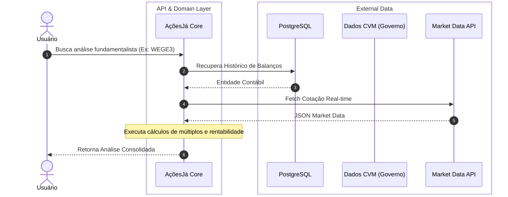

[🇺🇸 English Version](README-en.md)

  

  <strong>Plataforma de Inteligência de Mercado Financeiro e Cruzamento de Dados.</strong>

    
    
    
    

  <a href="#-screenshots">Screenshots</a> •
  <a href="#-sobre-o-projeto">Sobre</a> •
  <a href="#-principais-funcionalidades">Funcionalidades</a> •
  <a href="#-arquitetura">Arquitetura</a> •
  <a href="#-fluxo-de-dados">Fluxo de Dados</a>

## 📸 Screenshots

<table>
  <tr>
    <td valign="top" width="50%">
       
      <b>Dashboard Principal</b>
      
       
      <i>Visualização geral de índices, cotações e portfólio.</i>
    </td>
    <td valign="top" width="50%">
       
      <b>Análise de Ativo (PETR4)</b>
      
       
      <i>Gráficos dinâmicos e indicadores fundamentalistas.</i>
    </td>
  </tr>
</table>

## 📌 Sobre o Projeto

O **AçõesJá** é um ecossistema full-stack projetado para cruzar dados financeiros do mercado brasileiro com alta performance. O sistema ingere e processa gigabytes de dados contábeis governamentais diretamente da **CVM** (Balanços e DREs) e os cruza de forma estruturada com cotações e indicadores em tempo real da **B3**.

A plataforma opera nativamente em um modelo Freemium, oferecendo desde visualizações rápidas do último trimestre fiscal até exportações de planilhas financeiras densas (histórico de uma década) para assinantes.

## ✨ Principais Funcionalidades

- **Motor de Cruzamento CVM + B3:** Ingestão de balanços oficiais e cruzamento com preços de tela para cálculo de múltiplos de *Valuation*.
- **Pipeline ETL Otimizado:** Sincronizador de dados estruturado para lidar com atualizações diárias de bases governamentais massivas.
- **Cache e Alta Performance:** Emprego de estratégias de cache em memória para armazenar relatórios financeiros pesados, reduzindo o I/O do banco de dados.
- **Resiliência de Integração:** Mecanismos de *Retry* e tolerância a falhas garantem a estabilidade do sistema frente à oscilação ou *Rate Limits* de APIs externas (Brapi).
- **Autenticação Stateless:** Proteção robusta utilizando a plataforma Auth0 com JWTs curtos e Refresh Tokens rotativos.
- **Exportação Estruturada:** Motor de geração dinâmica de arquivos `.xlsx` formatados via *Apache POI* para análises offline.

## 🏗️ Arquitetura

O ecossistema adota princípios de **Clean Architecture** e **Domain-Driven Design (DDD)** para garantir o isolamento da lógica de precificação e análise fundamentalista.

- **Client Layer (React):** Single Page Application reativa que consome a API RESTful de forma otimizada.
- **API Layer (Spring Boot):** Camada de segurança e roteamento que isola o domínio do framework web.
- **Domain & Infrastructure Layer:** Concentra as regras de finanças, persistência relacional no PostgreSQL e as integrações síncronas/assíncronas.

## 🔀 Fluxo de Dados (Core)

```mermaid
sequenceDiagram
    autonumber
    actor User as Usuário
    box API & Domain Layer
        participant App as AçõesJá Core
    end
    box External Data
        participant DB as PostgreSQL
        participant CVM as Dados CVM (Governo)
        participant B3 as Market Data API
    end

    User->>App: Busca análise fundamentalista (Ex: WEGE3)
    App->>DB: Recupera Histórico de Balanços
    DB-->>App: Entidade Contábil
    App->>B3: Fetch Cotação Real-time
    B3-->>App: JSON Market Data
    Note over App: Executa cálculos de múltiplos e rentabilidade
    App-->>User: Retorna Análise Consolidada

```
---

  Desenvolvido com ☕ e código limpo por <a href="https://linktr.ee/raphaelfeijosalles" target="_blank">Raphael Salles</a>.

  <small>Copyright © 2026 Raphael Salles. Todos os direitos reservados. O código deste repositório é proprietário e não possui licença de código aberto (Open Source). O uso, cópia, distribuição ou modificação não autorizada é estritamente proibido.</small>

