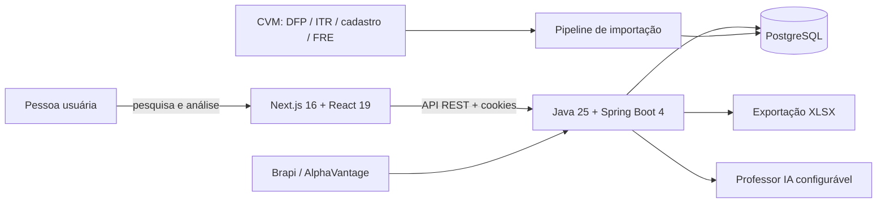
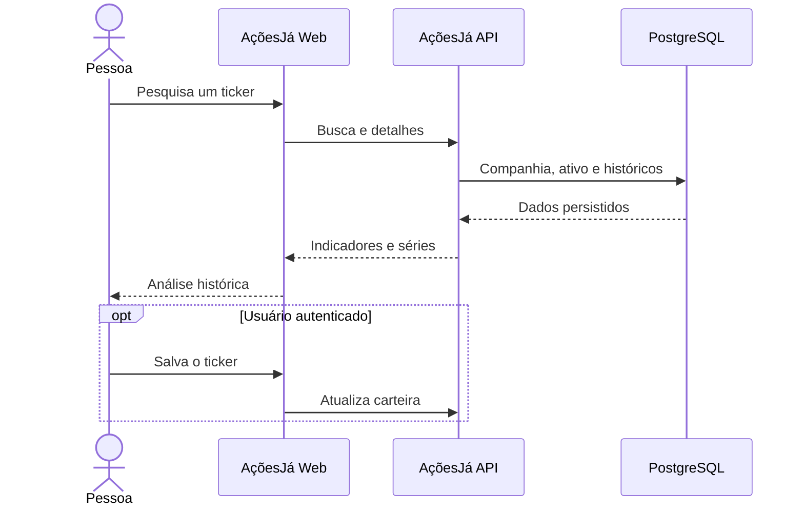

[🇺🇸 Read in English](README-en.md)

  

<h1 align="center">Dados financeiros brasileiros, organizados para análise</h1>

  Pesquise ativos, explore fundamentos e históricos e mantenha uma carteira de acompanhamento em uma experiência full-stack.

  
  
  
  
  

  <a href="#experiência">Experiência</a> ·
  <a href="#funcionalidades">Funcionalidades</a> ·
  <a href="#como-funciona">Como funciona</a> ·
  <a href="#para-recrutadores">Para recrutadores</a> ·
  <a href="https://acoesja.com.br">Demonstração</a> ·
  <a href="https://linktr.ee/raphaelfeijosalles">Contato</a>

> Plataforma educacional de análise financeira. O conteúdo não constitui recomendação de investimento.

## A proposta

Informações contábeis e dados de mercado costumam estar espalhados por fontes e formatos diferentes. O AçõesJá transforma esse material em uma jornada única:

1. pesquise uma empresa por ticker, nome ou CNPJ;
2. consulte indicadores e demonstrativos anuais ou trimestrais;
3. acompanhe o histórico de preços junto aos dados contábeis;
4. salve tickers em uma carteira de acompanhamento;
5. exporte análises autorizadas para `.xlsx`.

O projeto também automatiza a ingestão de DFP, ITR, cadastro de companhias e FRE da CVM, mantendo histórico, controles e auditoria do processo de importação.

## Experiência

<table>
  <tr>
    <td valign="top" width="50%">
      <strong>Dashboard e acompanhamento</strong> 
      
      <small>Entrada para pesquisa, informações de mercado e carteira de tickers.</small>
    </td>
    <td valign="top" width="50%">
      <strong>Análise de ativo</strong> 
      
      <small>Fundamentos, dados de mercado e histórico anual ou trimestral.</small>
    </td>
  </tr>
  <tr>
    <td valign="top" width="50%">
      <strong>Histórico financeiro</strong> 
      
      <small>Leitura estruturada de períodos e indicadores financeiros.</small>
    </td>
    <td valign="top" width="50%">
      <strong>Pesquisa unificada</strong> 
      
      <small>Descoberta pública de ativos por ticker, nome ou CNPJ.</small>
    </td>
  </tr>
</table>

### Acesso público

  
  <small>Consulta de fundamentos e histórico sem exigir login, com recursos autenticados claramente identificados.</small>

### Autenticação e consentimento

<table>
  <tr>
    <td valign="top" width="50%">
      <strong>Login por senha ou Google</strong> 
      
      <small>Acesso à carteira, exportação e Professor IA.</small>
    </td>
    <td valign="top" width="50%">
      <strong>Integração Google</strong> 
      
      <small>Fluxo social conectado ao domínio público.</small>
    </td>
  </tr>
  <tr>
    <td valign="top" width="50%">
      <strong>Termos de Uso versionados</strong> 
      
    </td>
    <td valign="top" width="50%">
      <strong>Política de Privacidade</strong> 
      
    </td>
  </tr>
</table>

### Professor IA em ação

  
  <small>Contexto selecionável, resposta educacional e aviso explícito para conferência das fontes.</small>

### Operação administrativa

<table>
  <tr>
    <td valign="top" width="50%">
      <strong>Bootstrap guiado de dados</strong> 
      
    </td>
    <td valign="top" width="50%">
      <strong>Publicação de documentos legais</strong> 
      
    </td>
  </tr>
  <tr>
    <td valign="top" colspan="2">
      <strong>Gestão de usuários e papéis</strong> 
      
    </td>
  </tr>
</table>

## Funcionalidades comprovadas

### Para quem analisa ativos

- Pesquisa e detalhes públicos.
- Indicadores fundamentalistas e históricos DFP/ITR.
- Histórico de cotações associado aos períodos financeiros.
- Carteira de acompanhamento após autenticação.
- Exportação XLSX para perfis autorizados.
- Professor IA contextual para explicações e comparação de métricas selecionadas.

### Identidade e experiência

- Cadastro e login por senha.
- Login social com Google.
- JWT em cookies HttpOnly e renovação silenciosa.
- Papéis de acesso e rotas administrativas.
- Termos de uso e política de privacidade versionados.
- Estados de carregamento, erro, conteúdo vazio e acesso restrito.

### Operação de dados

- Importação de DFP/ITR, cadastro e FRE da CVM.
- Separação entre demonstrativos consolidados e individuais.
- Persistência de cotações históricas.
- Brapi como integração de mercado e AlphaVantage como fallback de histórico.
- Histórico, erros, auditoria e reimportação dos pipelines.
- Geração de planilhas com Apache POI.

## Como funciona

```mermaid
flowchart LR
    Pessoa[Pessoa usuária] -->|pesquisa e análise| Web[Next.js 16 + React 19]
    Web -->|API REST + cookies| API[Java 25 + Spring Boot 4]
    API --> DB[(PostgreSQL)]
    CVM[CVM: DFP / ITR / cadastro / FRE] --> PIPE[Pipeline de importação]
    PIPE --> DB
    MARKET[Brapi / AlphaVantage] --> API
    API --> XLSX[Exportação XLSX]
    API --> AI[Professor IA configurável]
```

```mermaid
sequenceDiagram
    actor Pessoa
    participant Web as AçõesJá Web
    participant API as AçõesJá API
    participant DB as PostgreSQL

    Pessoa->>Web: Pesquisa um ticker
    Web->>API: Busca e detalhes
    API->>DB: Companhia, ativo e históricos
    DB-->>API: Dados persistidos
    API-->>Web: Indicadores e séries
    Web-->>Pessoa: Análise histórica
    opt Usuário autenticado
        Pessoa->>Web: Salva o ticker
        Web->>API: Atualiza carteira
    end
```

## Stack

| Backend | Frontend | Dados e entrega |
|---|---|---|
| Java 25 | Next.js 16 | PostgreSQL |
| Spring Boot 4.0.5 | React 19 | Flyway |
| Spring Security | TypeScript 5.9 | Docker |
| Spring Data JPA | TanStack Query | GitHub Actions |
| Spring AI/Caffeine | Axios/Zustand | Configuração Fly.io |
| Apache POI | Recharts/Tailwind | Dependabot |

## Decisões técnicas de alto nível

### Companhia não é ticker

`Company` representa o emissor; `Asset` representa o instrumento negociado. Uma companhia pode, assim, compartilhar demonstrações entre diferentes classes de ação.

### Schema evolui por migrations

Flyway registra mudanças de banco, enquanto Hibernate valida a estrutura em execução normal.

### Tokens permanecem fora do JavaScript

JWTs são transportados por cookies HttpOnly; o frontend coordena renovação e sessão sem ler diretamente os tokens.

### Consolidado e individual não se misturam

O pipeline identifica o escopo contábil e prioriza demonstrativos consolidados para preservar a coerência das análises.

## Para recrutadores

Este projeto demonstra trabalho full-stack sobre um domínio com regras, precisão numérica e integrações:

- API REST e processamento financeiro com Java 25 e Spring Boot 4.
- Interface orientada a dados com Next.js 16, React 19 e TypeScript.
- Modelagem relacional, JPA, PostgreSQL e migrations Flyway.
- Autenticação por senha/Google, JWT em cookies HttpOnly e autorização por papéis.
- Pipelines auditáveis de dados públicos da CVM e integrações de mercado.
- Testes automatizados e integração contínua nos repositórios de backend e frontend.

## Vamos conversar?

Se você quer discutir o produto, as decisões técnicas ou uma oportunidade Full-Stack Java + React/Next.js, entre em contato:

  <a href="https://linktr.ee/raphaelfeijosalles"><strong>Contato e perfil profissional</strong></a>

---

  Desenvolvido por Raphael Salles · Projeto proprietário, sem licença open source.

